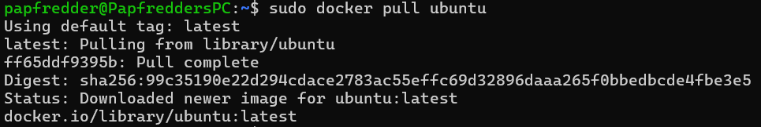
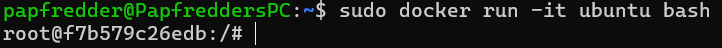
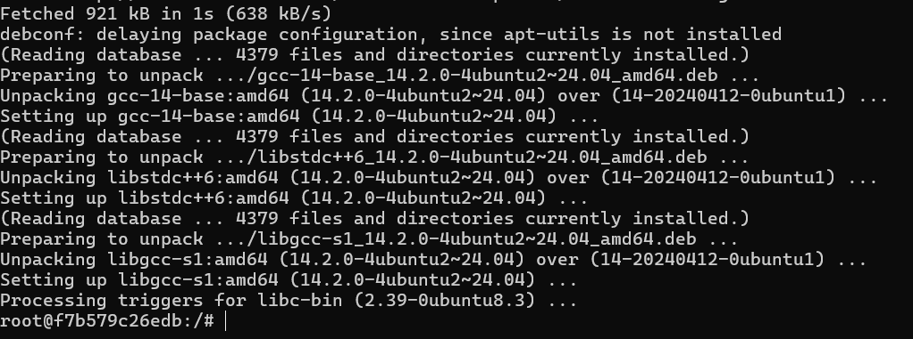
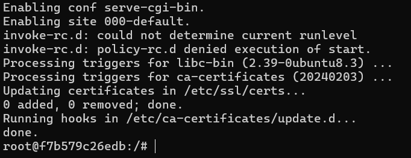
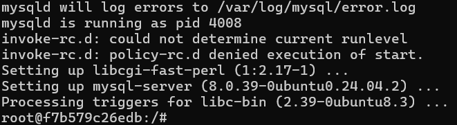
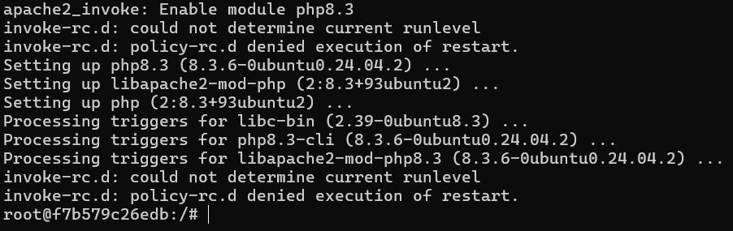

# Proyecto_Docker_03

En este proyecto vamos a aprender a instalar LAMP dentro de un contenedor de Ubuntu, y a utilizarlo junto a Apache y PHP, para rematar instalando WordPress.

Vamos a seguir los siguientes pasos:

    1. Proceso de Instalación LAMP
      1.1 Descarga de la imagen de Ubuntu
      1.2 Lanzamiento del contenedor de Ubuntu
      1.3 Actualización de los paquetes
      1.4 Instalación de Apache
      1.5 Instalación de MySQL
      1.6 Instalación de PHP
      1.7 Reinicio de Apache

    2. Instalación de WordPress
      2.1 Descarga de WordPress
      2.2 Configuración de los permisos
      2.3 Creación de una base de datos
      2.4 Configuración de WordPress

    3. Comprobación de acceso
      3.1 Acceso a WordPress mediante Apache

# 1. Proceso de instalación LAMP

> [!IMPORTANT]
> En este apartado vamos a tratar la instalación de previa de todos los requisitos necesarios para el funcionamiento de WordPress

## 1.1 Descarga de la imagen de Ubuntu

Para descargar la imagen de ubuntu mediante Docker utilizamos el siguiente comando:

> [!NOTE]
> Este comando se encarga de hacer un Pull a los servidores de docker para recoger la imagen deseada.

    sudo docker pull ubuntu

Resultado:

## 1.2 Lanzamiento del contenedor de Ubuntu

Para lanzar un contenedor derivado de la imagen de Ubuntu utilizamos el siguiente comando:

> [!NOTE]
> Este comando se encarga de crear un nuevo contenedor de la imagen que nosotros deseemos.

    sudo docker run -it ubuntu bash

Resultado:

## 1.3 Actualización de los paquetes

Para actualizar los paquetes de instalación utilizamos el siguiente comando dentro del contenedor:

> [!NOTE]
> Este comando se encarga de actualizar los paquetes de instalación que se encuentran en la base de datos

    apt update && apt upgrade -y

Resultado:

## 1.4 Instalación de Apache

Para instalar Apache vamos a utilizar el siguiente comando:

> [!NOTE]
> Este comando se encarga de descargar Apache desde la base de datos de Ubuntu 

    apt install apache2 -y

Resultado:

## 1.5 Instalación de MySQL

Para instalar MySQL utilizamos el siguiente comando:

> [!NOTE]
> Este comando se encarga de descargar MySQL desde la base de datos de Ubuntu

    apt install mysql-server -y

Resultado:

## 1.6 Instalación de PHP

Para instalar PHP utilizamos el siguiente Comando:

> [!NOTE]
> Este comando se encarga de descargar PHP desde la base de datos de Ubuntu

    apt install php libapache2-mod-php php-mysql -y

Resultado:

## 1.7 Reinicio de Apache

Para reiniciar Apache utilizamos el siguiente comando: 

> [!NOTE]
> Este comando se encarga reiniciar Apache para poder aplicar todos los datos nuevos que hemos introducido

    systemctl restart apache2

# 2. Instalación de WordPress

> [!IMPORTANT]
> En este apartado trataremos la instalación de WordPress y la configuración de todos sus permisos y bases de datos

## 2.1 Descarga de Wordpress

Para descargar e instalar Wordpress utilizamos los siguientes comandos:

> [!NOTE]
> Estos comandos se encargan de la descarga de wordpress mediante un Wget

    cd /var/www/html
    wget https://wordpress.org/latest.tar.gz
    tar -xvzf latest.tar.gz
    mv wordpress/* .
    rm -rf wordpress latest.tar.gz

## 2.2 Configuración de los permisos

Para configurar los permisos de WordPress se utilizan los siguientes comandos

> [!NOTE]
> Estos comandos sirven para configurar los permisos de WordPress

    chown -R www-data:www-data /var/www/html
    chmod -R 755 /var/www/html

## 2.3 Creación de la base de datos

> [!NOTE]
> Estos comandos sirven para configurar y crear una base de datos para WordPress

    mysql -u root -p
    CREATE DATABASE wordpress;
    EXIT;

## 2.4 Configuración de WordPress

> [!NOTE]
> Estos comandos sirven para configurar la propia aplicación de WordPress

    define('DB_NAME', '[INTRODUCIR NOMBRE]');
    define('DB_USER', 'root');
    define('DB_PASSWORD', '[INTRODUCIR CONTRASEÑA]');
    define('DB_HOST', 'localhost');

## 3 Comprobación de Acceso

> [!IMPORTANT]
> En este apartado trataremos el como acceder a la página de WordPress mediante Apache

## 3.1 Acceso a WordPress mediante Apache

Para acceder a WordPress mediante Apache usamos el sisguiente comando

> [!NOTE]
> Este comando sirve para iniciar el servidor de Apache

    systemctl start apache2

Finalmente navegamos a http://<IP_del_contenedor> para acceder al sistema y comprobar que todo funcione
